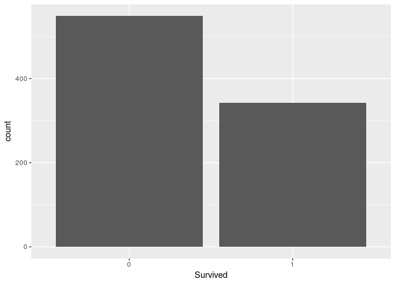
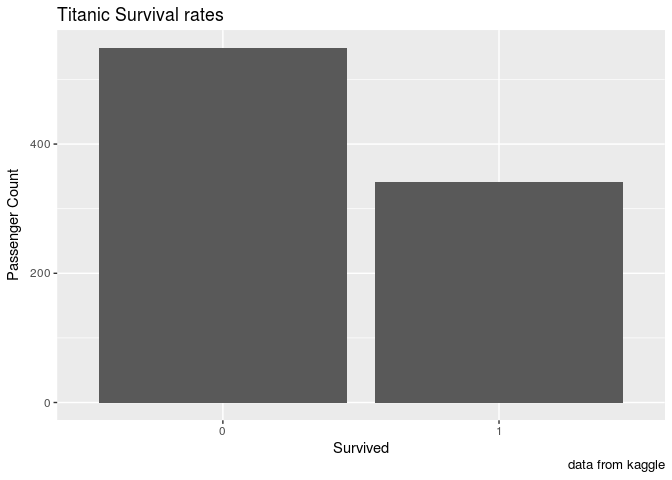
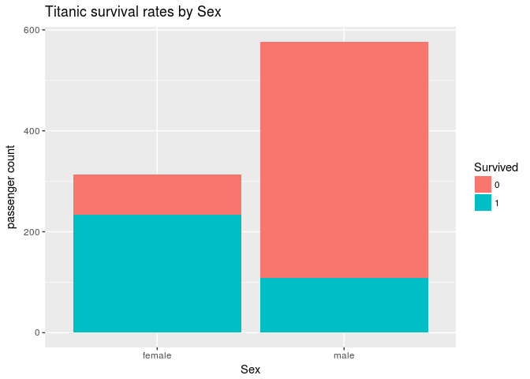

Titanic Plots
================
kaymas

Data Dictionary
---------------

This is the data dictionary used for the data from the [Kaggle Titanic competition](https://www.kaggle.com/c/titanic) that is included in a csv file format

| Variable | Definition                                              |
|----------|---------------------------------------------------------|
| survived | Integer boolean for the passenger's survival            |
| pclass   | Ticket Class from the set {1,2,3}                       |
| sex      | Sex of the passenger (only male and female defined)     |
| age      | Age in years (float)                                    |
| sibsp    | \# of siblings / spouses abord                          |
| parch    | \# of parents / children abord                          |
| ticket   | Ticket number                                           |
| fare     | Passenger fare (currency - Pound)                       |
| cabin    | Cabin number                                            |
| embarked | Port from where passenger Embarked from the set {C,Q,S} |

(passengerId and Name not included in the data dictionary because they are just unique identifiers)

Code & shit
-----------

### Importing Data

First we import the data using the `read.csv()` function. Here we have used the argument `stringsAsFactors = FLASE` since we ourselves explicitly want to choose the columns or variables that will be categorical. For example, if you look at the data, survived should be categorical but it is interpreted as a numeric vector by R.

``` r
titanic <- read.csv("titanic.csv", stringsAsFactors = FALSE)
```

Second we setup the factors in the dataframe that is **titanic**

``` r
titanic$Pclass <- as.factor(titanic$Pclass)
titanic$Survived <- as.factor(titanic$Survived)
titanic$Sex <- as.factor(titanic$Sex)
titanic$Embarked <- as.factor(titanic$Embarked)
```

Now if we look at the class of every column of titanic we can see that:

    ## PassengerId -> integer
    ## Survived -> factor
    ## Pclass -> factor
    ## Name -> character
    ## Sex -> factor
    ## Age -> numeric
    ## SibSp -> integer
    ## Parch -> integer
    ## Ticket -> character
    ## Fare -> numeric
    ## Cabin -> character
    ## Embarked -> factor

### Visualizations

#### What is survival rate?

> Since survived is a factor (categorical variable), we can use a bar chart as it is a great visualization tool for factors

##### Basic plot

``` r
library(ggplot2)
ggplot(data = titanic, mapping = aes(x = Survived)) + geom_bar()
```



##### Relative percentages

To get the relative percentages(for this we use `prop.table()` function) for the above graph just use this code snippet.

``` r
surRelPer <- prop.table(table(titanic$Survived))
surRelPer
```

    ## 
    ##         0         1 
    ## 0.6161616 0.3838384

Here `table()` gives the total count for each level of the categorical variable survived.

> From this we can see that 61.62% people survived.

##### plot customizations

``` r
ggplot(data = titanic, mapping = aes(x = Survived)) +
  geom_bar() + 
  labs(y = "Passenger Count", title = "Titanic Survival rates") + 
  labs(caption = "data from kaggle")
```



#### What is survival rate by gender?

> We can use colour to examine the dimensions of the data

``` r
ggplot(data = titanic, mapping = aes(x = Sex,fill = Survived)) +
  geom_bar() + 
  labs(y = "passenger count", title = "Titanic survival rates by Sex")
```



If `fill` argument is given a categorical variable then the `aes` function tells the plot to fill geometric structures in this case the bars of the barchart to be filled with the counts proportional to the bar on the x axis.

> From this we can get the information that most males didn't survive or most females did.
