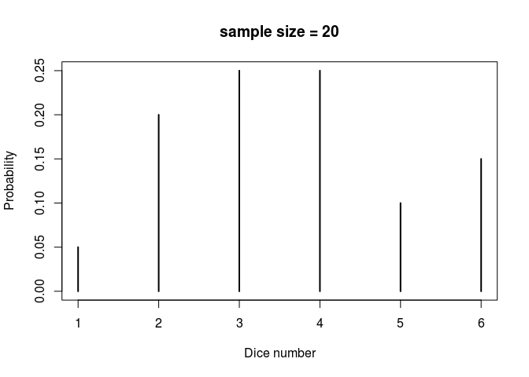
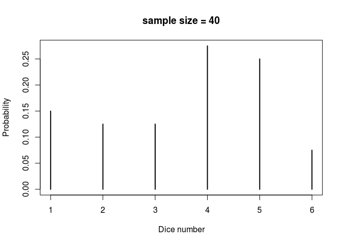
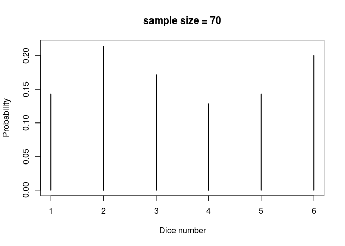
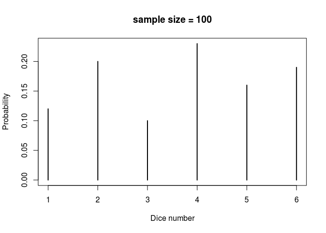
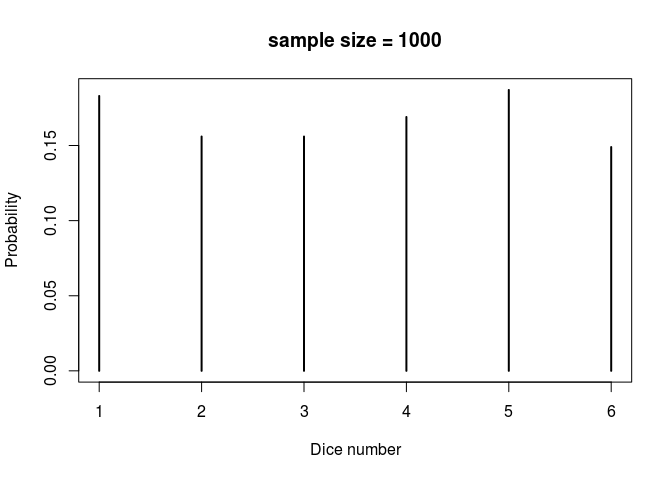

Question 13
================
samyak

Program to calculate probability distribution of a random variable X that is the number of the face on top when a dice is rolled.
---------------------------------------------------------------------------------------------------------------------------------

Code
----

The method that we are using to obtain a probability distribution is the repeated random sampling procedure.

### Getting random sample

Here we use the function `sample` that takes a sample of specified size from elements of a vector with or without replacement.
So to get a random sample of size 20 of the heads of dice we can use the following

``` r
dice_numbers <- 1:6
dice_sample <- sample(dice_numbers, size = 20, replace = TRUE)
```

Doing this we get the random sample as

    ##  [1] 2 5 3 4 4 6 4 3 2 1 6 3 4 3 2 6 4 5 2 3

### Approximating probabilities of a random sample

We can count the frequencies of each random outcome using the `table` function

``` r
table(dice_sample)
```

    ## dice_sample
    ## 1 2 3 4 5 6 
    ## 1 4 5 5 2 3

Now what we need is the *relative* frequency. To obtain that we need to divide the frequency of each outcome by the number of times the experiment was carried out.

``` r
probability_dist <- table(dice_sample) / length(dice_sample)
probability_dist
```

    ## dice_sample
    ##    1    2    3    4    5    6 
    ## 0.05 0.20 0.25 0.25 0.10 0.15

### Visual representation of the distribution

We can use the `plot` function with the table as input and plot the probability distribution of occurence of each outcome.

``` r
plot(probability_dist, xlab = "Dice number", ylab = "Probability", main = "sample size = 20")
```



Examples
--------

### random sample of size 40

``` r
dice_sample <- sample(dice_numbers, size = 40, replace = TRUE)
probability_dist <- table(dice_sample) / length(dice_sample)
plot(probability_dist, xlab = "Dice number", ylab = "Probability", main = "sample size = 40")
```



### random sample of size 70

``` r
dice_sample <- sample(dice_numbers, size = 70, replace = TRUE)
probability_dist <- table(dice_sample) / length(dice_sample)
plot(probability_dist, xlab = "Dice number", ylab = "Probability", main = "sample size = 70")
```



### random sample of size 100

``` r
dice_sample <- sample(dice_numbers, size = 100, replace = TRUE)
probability_dist <- table(dice_sample) / length(dice_sample)
plot(probability_dist, xlab = "Dice number", ylab = "Probability", main = "sample size = 100")
```



### random sample of size 1000

``` r
dice_sample <- sample(dice_numbers, size = 1000, replace = TRUE)
probability_dist <- table(dice_sample) / length(dice_sample)
plot(probability_dist, xlab = "Dice number", ylab = "Probability", main = "sample size = 1000")
```


