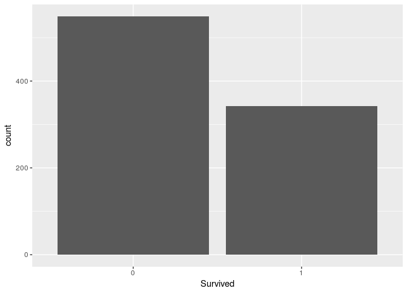
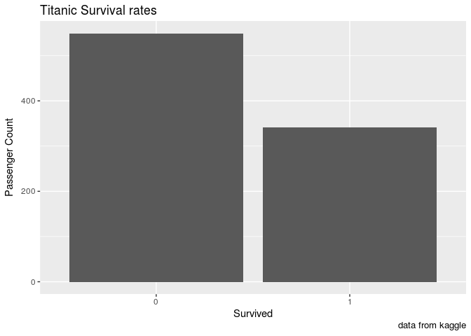
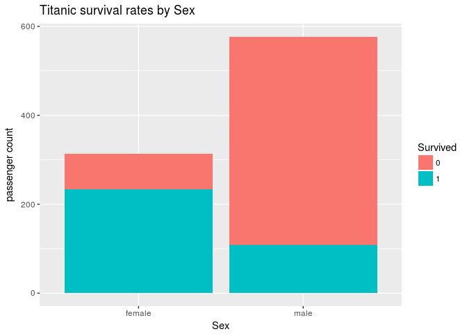
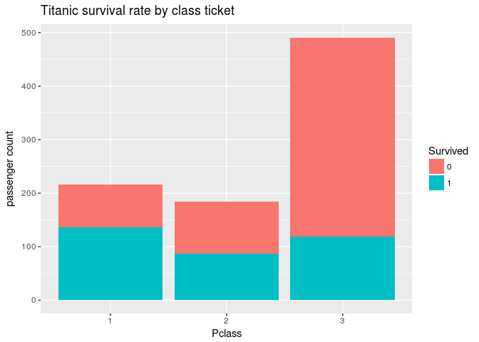
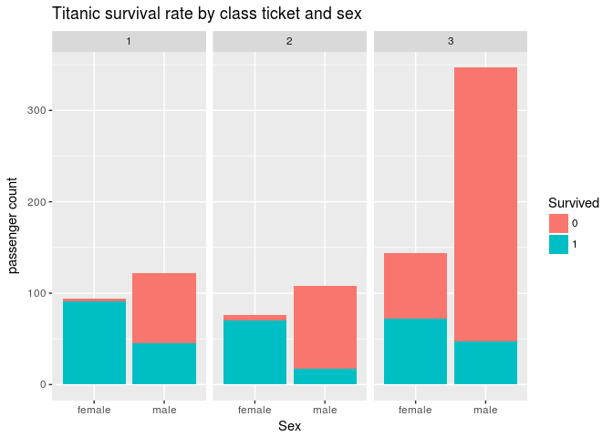
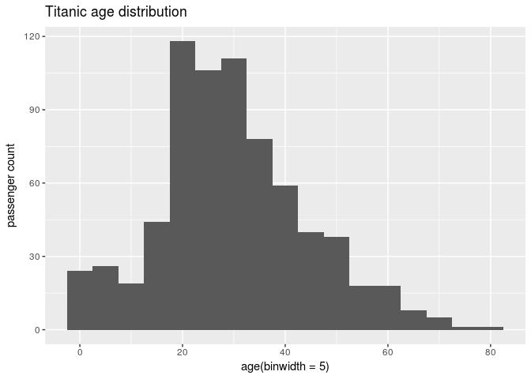
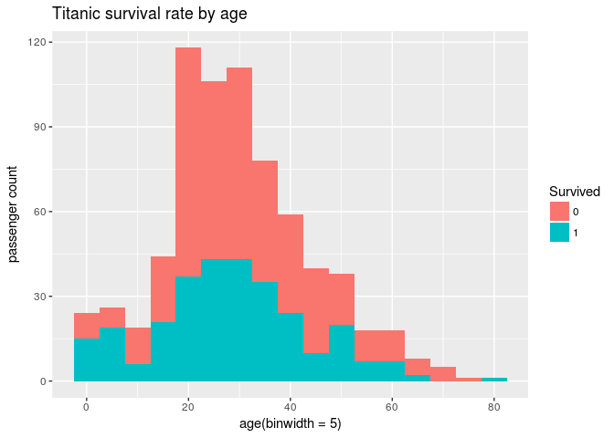
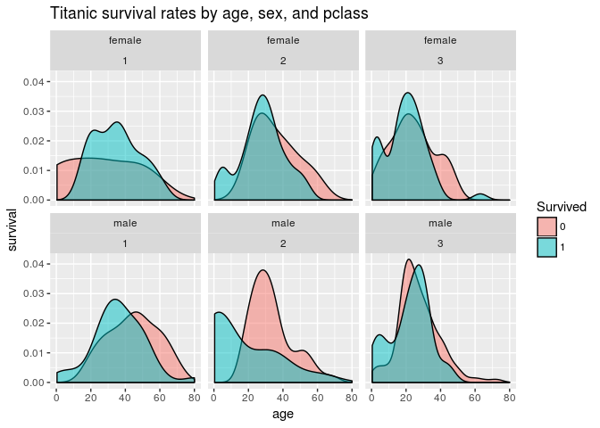
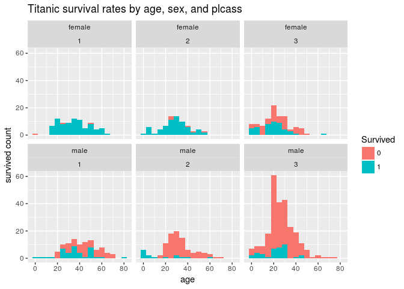

Question 14
================
samyak

Program to make visual representations of a data set using ggplot2
------------------------------------------------------------------

Data Dictionary
---------------

This is the data dictionary used for the data from the [Kaggle Titanic competition](https://www.kaggle.com/c/titanic) that is included in a csv file format

| Variable | Definition                                              |
|----------|---------------------------------------------------------|
| survived | Integer boolean for the passenger's survival            |
| pclass   | Ticket Class from the set {1,2,3}                       |
| sex      | Sex of the passenger (only male and female defined)     |
| age      | Age in years (float)                                    |
| sibsp    | \# of siblings / spouses abord                          |
| parch    | \# of parents / children abord                          |
| ticket   | Ticket number                                           |
| fare     | Passenger fare (currency - Pound)                       |
| cabin    | Cabin number                                            |
| embarked | Port from where passenger Embarked from the set {C,Q,S} |

(passengerId and Name not included in the data dictionary because they are just unique identifiers)

Code
----

### Importing Data

First we import the data using the `read.csv()` function. Here we have used the argument `stringsAsFactors = FLASE` since we ourselves explicitly want to choose the columns or variables that will be categorical. For example, if you look at the data, survived should be categorical but it is interpreted as a numeric vector by R.

``` r
titanic <- read.csv("titanic.csv", stringsAsFactors = FALSE)
```

Second we setup the factors in the dataframe that is **titanic**

``` r
titanic$Pclass <- as.factor(titanic$Pclass)
titanic$Survived <- as.factor(titanic$Survived)
titanic$Sex <- as.factor(titanic$Sex)
titanic$Embarked <- as.factor(titanic$Embarked)
```

Now if we look at the class of every column of titanic we can see that:

    ## PassengerId -> integer
    ## Survived -> factor
    ## Pclass -> factor
    ## Name -> character
    ## Sex -> factor
    ## Age -> numeric
    ## SibSp -> integer
    ## Parch -> integer
    ## Ticket -> character
    ## Fare -> numeric
    ## Cabin -> character
    ## Embarked -> factor

### Visualization of categorical data

#### What was the survival rate?

> Since survived is a factor (categorical variable), we can use a bar chart as it is a great visualization tool for factors

##### Basic plot

``` r
library(ggplot2)
ggplot(data = titanic, mapping = aes(x = Survived)) + geom_bar()
```



##### Relative percentages

To get the relative percentages(for this we use `prop.table()` function) for the above graph just use this code snippet.

``` r
surRelPer <- prop.table(table(titanic$Survived))
surRelPer
```

    ## 
    ##         0         1 
    ## 0.6161616 0.3838384

Here `table()` gives the total count for each level of the categorical variable survived.

> From this we can see that 61.62% people survived.

##### plot customizations

``` r
ggplot(data = titanic, mapping = aes(x = Survived)) +
  geom_bar() + 
  labs(y = "Passenger Count", title = "Titanic Survival rates") + 
  labs(caption = "data from kaggle")
```



#### What was the survival rate by gender?

> We can use colour to examine the dimensions of the data

``` r
ggplot(data = titanic, mapping = aes(x = Sex,fill = Survived)) +
  geom_bar() + 
  labs(y = "passenger count", title = "Titanic survival rates by Sex")
```



If `fill` argument is given a categorical variable then the `aes` function tells the plot to fill geometric structures, in this case the bars of the barchart, with the counts proportional to the bar on the x axis.

> From this we can get the information that most males didn't survive but most females did.

#### What was the survival rate by the class of the ticket?

``` r
ggplot(data = titanic, mapping = aes(x = Pclass, fill = Survived)) + 
  geom_bar() + 
  labs(y = "passenger count", title = "Titanic survival rate by class ticket")
```



> Well, It is blatantly clear that the survival of third class ticket holders is way below second or first class ticket holders.

#### What was the survival rate by class of the ticket and gender?

``` r
ggplot(data = titanic, mapping = aes(x = Sex, fill = Survived)) +
  facet_wrap(~ Pclass) +
  geom_bar() +
  labs(y = "passenger count", title = "Titanic survival rate by class ticket and sex")
```



`ggplot` has this mechanism of faceting which further segments the data.

### Visualization of continuous data

#### What is the distribution of passenger ages?

> Here ages is a numeric data and histograms really are a staple when it comes to numeric data as it very powerfully communicates the distribution of a variable.

``` r
ggplot(data = titanic, mapping = aes(x = Age)) + 
  geom_histogram(binwidth = 5) + 
  labs(title = "Titanic age distribution", x = "age(binwidth = 5)", y = "passenger count")
```

    ## Warning: Removed 177 rows containing non-finite values (stat_bin).



Histogram's visual shape changes on the bases of value of binwidth. Setting binwidth equal to 5 states that we want to combine ages into blocks/bins of 5 years

> Do note the warning messgae given above. It says that it wasn't able to procure ages from some of the rows since they contained non-finite values(same as not containing any value) and hence they were removed from consideration. So in this case `ggplot` handles empty value rows and you don't explictly have to remove them in fear of the function halting in error.

#### What are the survival rates by age

``` r
ggplot(data = titanic, mapping = aes(x = Age, fill = Survived)) + 
  geom_histogram(binwidth = 5) + 
  labs(title = "Titanic survival rate by age", y = "passenger count", x = "age(binwidth = 5)")
```

    ## Warning: Removed 177 rows containing non-finite values (stat_bin).



#### Plotting the survival rate by age, sex, and class

##### Using a density plot

``` r
ggplot(data = titanic, mapping = aes(x = Age, fill = Survived)) +
  facet_wrap(Sex ~ Pclass) +
  geom_density(alpha = 0.5) +
  labs(x = "age", y = "survival", title = "Titanic survival rates by age, sex, and pclass")
```

    ## Warning: Removed 177 rows containing non-finite values (stat_density).



Here `alpha` argument used on `geom_density` is just the transparency level of the overlay of fill.

##### Using a histogram

``` r
ggplot(data = titanic, mapping = aes(x = Age, fill = Survived)) +
  facet_wrap(Sex ~ Pclass) + 
  geom_histogram(binwidth = 5) +
  labs(x = "age", y = "survived count", title = "Titanic survival rates by age, sex, and plcass")
```

    ## Warning: Removed 177 rows containing non-finite values (stat_bin).


